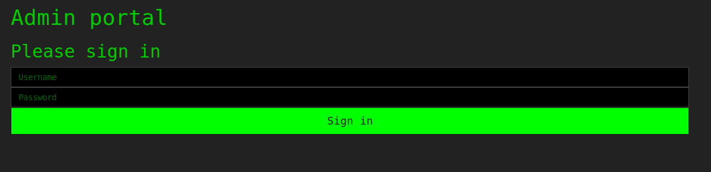

# Microseconds

**Web, 250 points**

> I've found this weird website while going through the internal network of EVILCORP, but somehow I'm stuck, can you help ?

> http://194.78.18.226

## Solution

We have a website with a login and a password.
Because we don't see that much thing on this page, we go to the source.
We see there a little TODO commented: `<!-- TODO remove index.bak -->`

When we go to that page, we have the PHP source of the website.

	<?php
        if ($_SERVER['REQUEST_METHOD'] === 'POST') {

            $username = $_POST['username'];
            $password = MD5($_POST['password']);

            $salt = microtime(); 

            // plaintext is fine nobody sees this anyway and I have a secure salt !
            $admin_password = 'supersecurepassword'; 

            $admin_hash = MD5('$salt'.'$admin_password');
            if($username === 'admin' and $password === $admin_hash){
                echo file_get_contents('flag.txt');
            }
            else{
                echo "";
            }
        }
	?>

We see an hash computation with the admin password and a salt.
The admin password is `supersecurepassword` and the salt the time in microsecond.

We quickly come to the fact that the salt can't be computed easily.
There should be another way.

After better inspection, we see that it doesn't use any of those variables to compute the hash it is just a string concatenation of the name of the two variables.

After trying `admin` as username and `$salt$admin_password` as password, we get the flag:

    Well done, here is your flag {2qu0t3orNot2quOt3th4tizth3qu3St1on}
