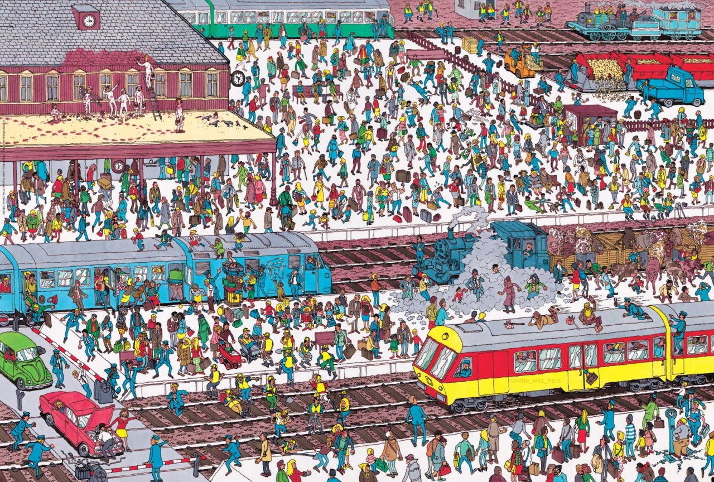

# Where is waldo

**Steganography, 33 points**

> Find the hidden message.
> *Note: the `Z` in the flag is in upper-case, not lower-case*

Attachment: `challenge.jpg`

# Solution

The flag is hidden in the lower right of the screen, on the yellow part of the train.
The flag is written is a slightly darker yellow.

Flag: `W4ldo_w4Z_hEr3`
